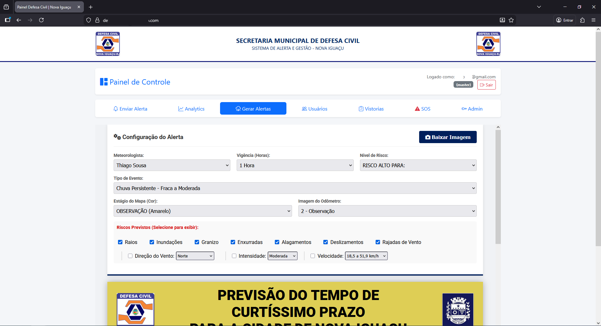
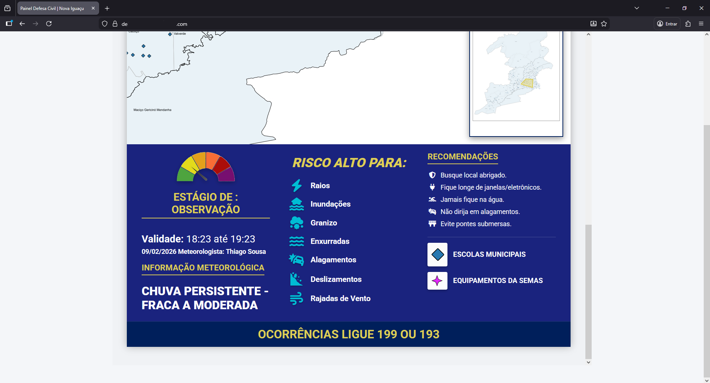
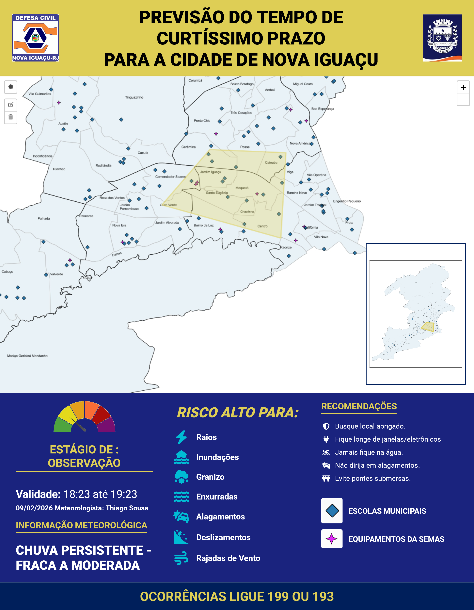

# ⛈️ Gerador-de-Alertas-Meteorologicos-Defesa-Civil
Ferramenta de geração automática de alertas meteorológicos georreferenciados para a Defesa Civil de Nova Iguaçu, com mapas interativos e exportação de imagem.

> **Nota:** Este é um repositório de portfólio. O código-fonte é propriedade privada e/ou de uso restrito governamental, portanto, apenas a documentação técnica e demonstração de funcionalidades estão disponíveis aqui.

## 🎯 Sobre o Projeto

Desenvolvido para a **Defesa Civil de Nova Iguaçu**, este sistema é uma aplicação web *single-page* (SPA) projetada para agilizar a criação e padronização de comunicados de riscos meteorológicos.

Antes desta ferramenta, a criação de alertas visuais dependia de editores de imagem manuais, o que consumia tempo crítico em situações de emergência. O sistema automatiza a formatação visual, garantindo que a identidade visual e as informações técnicas (meteorologista, data, nível de risco) sigam padrões rigorosos.

## 📸 Demonstração

*Interface de configuração mostrando o painel de controle.*

*Interface de configuração mostrando o mapa interativo.*

*Interface mostrando a legenda do alerta em tempo real.*

### Resultado Final (Exportação)

*Exemplo de imagem gerada automaticamente pelo sistema pronta para divulgação.*

## 🚀 Funcionalidades Principais

* **Mapeamento Interativo (GIS):**
    * Utilização da biblioteca **Leaflet.js** para renderização de mapas.
    * Ferramenta de desenho (**Leaflet Draw**) permitindo que o operador delimite a área de risco (polígono) diretamente sobre o mapa da cidade.
    * **Sincronização de Mini-Mapa:** Um algoritmo personalizado sincroniza o desenho do mapa principal com um "mini-mapa" estático posicionado no layout final da imagem.
* **Tematização Dinâmica:**
    * O sistema altera todo o esquema de cores (CSS Variables) e ícones automaticamente com base no nível de risco selecionado (Vigilância, Observação, Atenção, Alerta, Alerta Máximo).
* **Lógica de Recomendações:**
    * Sistema inteligente que sugere recomendações de segurança (ícones e textos) baseados no tipo de evento (ex: "Vendaval" carrega ícones de perigo de queda de árvores; "Alagamento" carrega ícones de não atravessar áreas alagadas).
* **Exportação Client-Side:**
    * Utilização do **html2canvas** para renderizar o DOM em um arquivo de imagem (`.png`) de alta resolução, pronto para redes sociais (Instagram/WhatsApp).

## 🛠️ Tecnologias e Desafios Técnicos

### Stack
* **Front-end:** HTML5, CSS3 (Flexbox & CSS Variables), Vanilla JavaScript (ES6+).
* **Mapas:** Leaflet.js, Leaflet Draw.
* **Processamento de Imagem:** html2canvas.

### Destaques da Implementação (Engenharia)
Embora o código seja fechado, destaco os seguintes desafios resolvidos:

1.  **Manipulação do DOM para Canvas:** O maior desafio foi garantir que o mapa do Leaflet (que é dinâmico) fosse renderizado corretamente estaticamente pelo `html2canvas` sem "glitches" visuais ou perda de qualidade no zoom.
2.  **Observer Pattern Simples:** Implementação de ouvintes de eventos para que a mudança em um *input* (ex: "Intensidade: Muito Forte") dispare atualizações em cascata: muda a cor do tema, marca checkboxes de riscos associados e atualiza a velocidade do vento estimada.
3.  **Design Responsivo para Impressão:** O layout foi construído com dimensões fixas específicas para garantir a legibilidade tanto em telas de celular quanto em impressões físicas para relatórios.

## 👤 Autor

**Lucas Nunes**
*Desenvolvedor Full Stack & Android*

Entre em contato para discutir sobre a arquitetura deste projeto ou oportunidades de trabalho.

